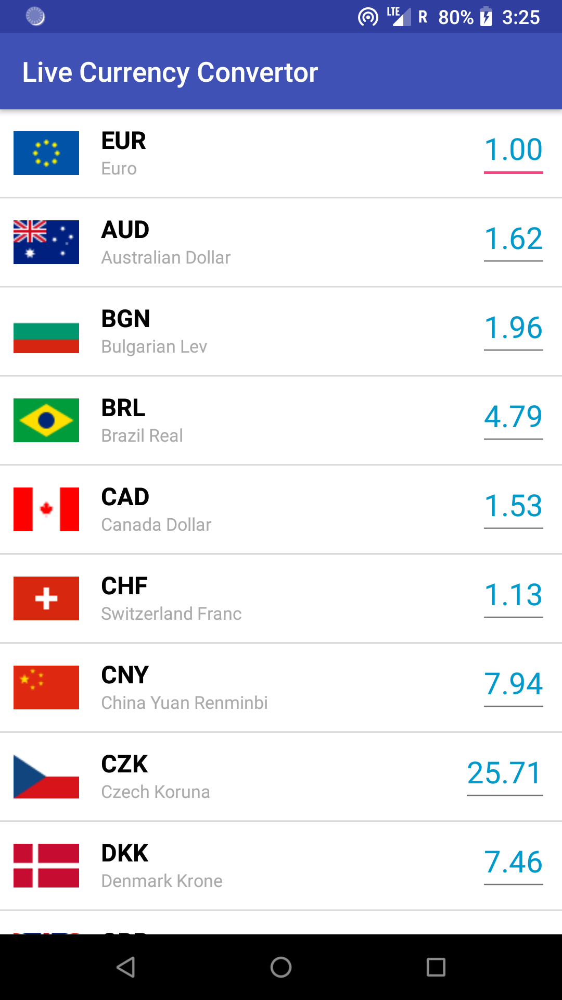
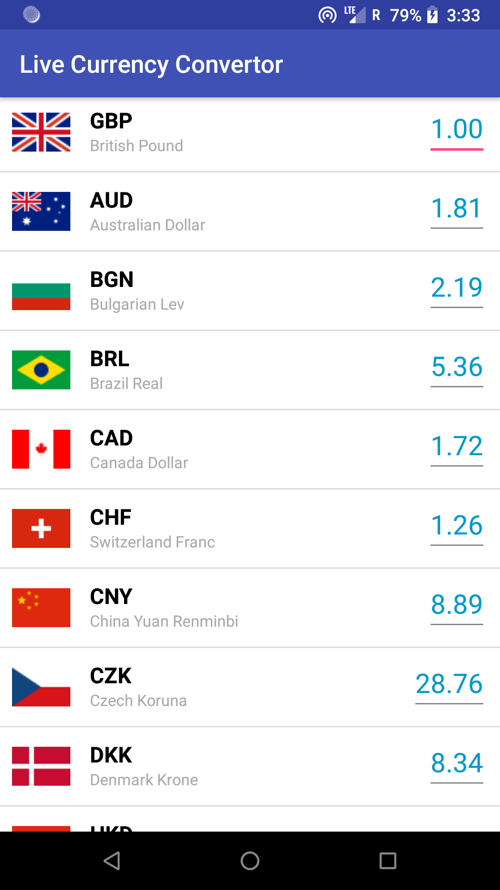
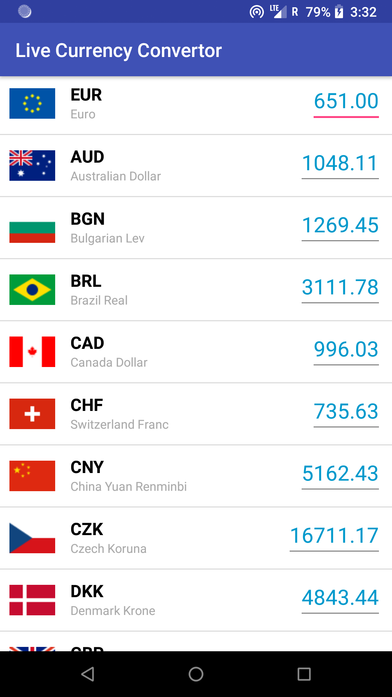
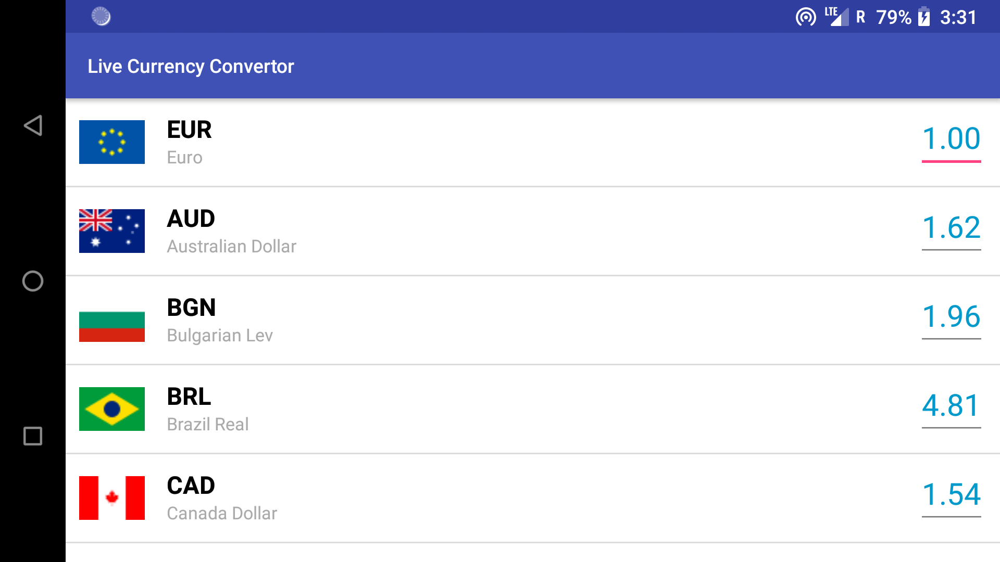

# LiveCurrencyConverter

## Features Implemented
    Display list of all currencies as retrieved from JSON list from API.
    Update rates periodically every one second from API.
    Top Currency is base currency.
    Select any currency : Slide currency to top by clicking on it.
    Enter any amount and convert all other currencies with respect to that amount.
    Show country flag and full name on UI.
    
    
## Architecture components / Libraries Used:
    MVVM Architecture
    Live Data for Lifecycle aware data holder.
    Rx Java for reactive programming.
    Retrofit for Network calls
    ButterKnife for View Binding
    Dagger for Dependency Injection
    Gson for Json conversion.
    AutoValue for name, value pair resolution.
    
Languages : Kotlin and Java.

## Screenshots

## Built With

* [Android Studio](https://developer.android.com/studio/index.html) - The Official IDE for Android
* [Java] (https://oracle.com/technetwork/java/javase/overview/java8-2100321.html)
* [Kotlin](https://kotlinlang.org/) - The Official Language for Android
* [Gradle](https://gradle.org/) - Build tool for Android Studio
